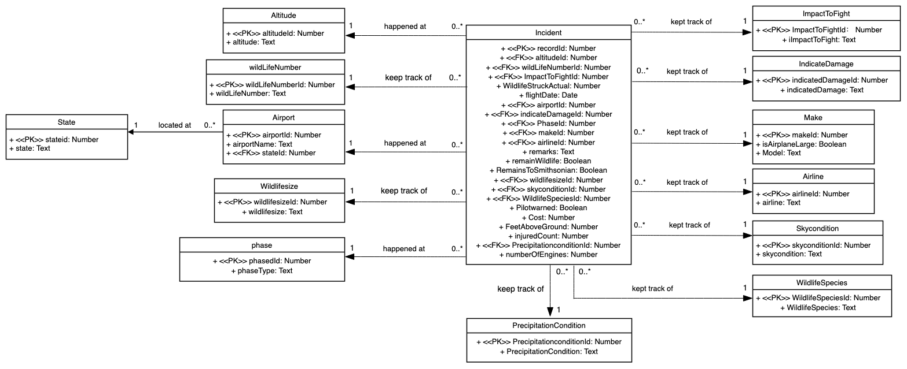
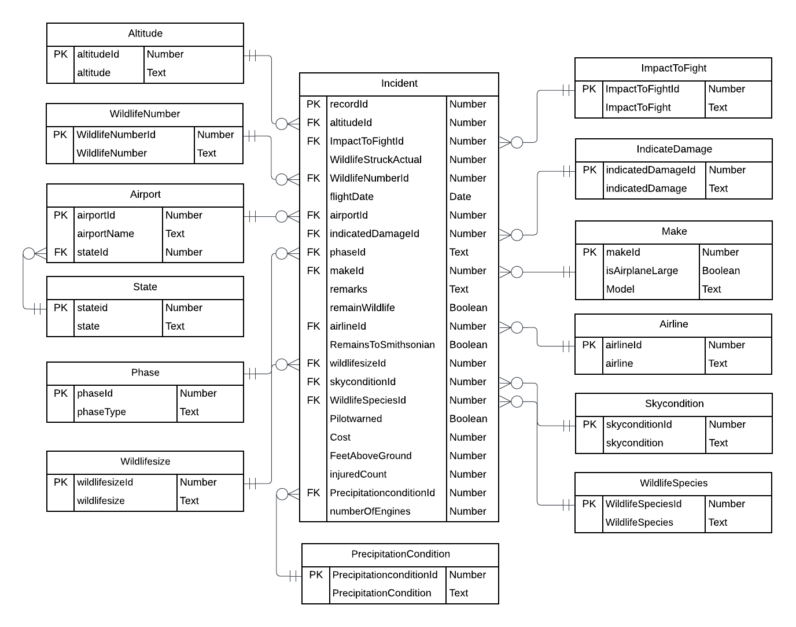

## This is the R notebook of 5200 Team2 Practicum 1.
## ---

#### Here is the UML diagram for this practicum.

#### Here is the Relational Schema for this practicum.


### Set up the connection with the mysql database using your own credentials.
```{r}

require(RMySQL)
db_user <- 'root'
db_password <- 'yourpassword'
db_name <- '5200Practicum1'
db_host <- 'localhost'
db_port <- 3306

mydb <-  dbConnect(MySQL(), user = db_user, password = db_password,
                    dbname = db_name, host = db_host, port = db_port)
```

### We enable the writing functions to the database, otherwise it won't allow the data insert.
```{r}
dbSendQuery(mydb, "SET GLOBAL local_infile = true;") 
```


```{r}
dbListTables(mydb)
```
```{sql connection=mydb}
DROP TABLE IF EXISTS master
```

### Convert the csv file into a data frame
```{r}
path = "/Users/hxg/Documents/NortheasternUniversity/5200DatabaseManagementSystems/Practicum1/"
fn <- "BirdStrikesData-1.csv"

fileName <- paste(path, fn, sep = "/")

birdStrikesDF <- read.csv(fileName, header = TRUE, stringsAsFactors = FALSE)
head(birdStrikesDF,4)
```

### Rename the column name for future processing
```{r}
colnames(birdStrikesDF)[1] <- "RecordID"
colnames(birdStrikesDF)[2] <- "Aircraft_Type"
colnames(birdStrikesDF)[3] <- "Airport"
colnames(birdStrikesDF)[4] <- "Altitude_bin"
colnames(birdStrikesDF)[5] <- "Aircraft_Make_Model"
colnames(birdStrikesDF)[6] <- "Wildlife_Number_struck"
colnames(birdStrikesDF)[7] <- "Wildlife_Number_Struck_Actual"
colnames(birdStrikesDF)[8] <- "Effect_Impact_to_flight"
colnames(birdStrikesDF)[9] <- "FlightDate"
colnames(birdStrikesDF)[10] <- "Effect_Indicated_Damage"
colnames(birdStrikesDF)[11] <- "Aircraft_Number_of_engines"
colnames(birdStrikesDF)[12] <- "Airline"
colnames(birdStrikesDF)[13] <- "State"
colnames(birdStrikesDF)[14] <- "When_Phase"
colnames(birdStrikesDF)[15] <- "Conditions_Precipitation"
colnames(birdStrikesDF)[16] <- "Remains_of_wildlife_collected"
colnames(birdStrikesDF)[17] <- "Remains_of_wildlife_sent_to_Smithsonian"
colnames(birdStrikesDF)[18] <- "Remarks"
colnames(birdStrikesDF)[19] <- "Wildlife_Size"
colnames(birdStrikesDF)[20] <- "Conditions_Sky"
colnames(birdStrikesDF)[21] <- "Wildlife_Species"
colnames(birdStrikesDF)[22] <- "Pilot_warned"
colnames(birdStrikesDF)[23] <- "Cost"
colnames(birdStrikesDF)[24] <- "Feet_above_ground"
colnames(birdStrikesDF)[25] <- "Number_injured"
colnames(birdStrikesDF)[26] <- "Is_Aircraft_Large"

```


```{sql connection=mydb}
drop table if exists master
```

### Create master table based on the csv file
```{r}
dbWriteTable(mydb, "master", birdStrikesDF, overwrite = T)

```

```{sql connection=mydb}
SET GLOBAL sql_mode=(SELECT REPLACE(@@sql_mode,'ONLY_FULL_GROUP_BY',''));
```


```{sql connection=mydb}
select count(*) from master
```

### Clean up the date where FlightDate is null
```{sql connection=mydb}
DELETE FROM master WHERE FlightDate = ''
```
### Pre work before we create state table
```{sql connection=mydb}
DROP TABLE IF EXISTS state
```

### Create state table
```{sql connection=mydb}
CREATE TABLE state(
  stateid INTEGER PRIMARY KEY AUTO_INCREMENT,
  stateName TEXT NOT NULL
);  
```
### Load state table with data
```{sql connection=mydb}
insert into state (stateName) select state from master group by state
```

### For the next 12 tables, repeat the same steps like what we did to create state table.
```{sql connection=mydb}
drop table if exists airport
```

```{sql connection=mydb}
CREATE TABLE airport(
  airportid INTEGER PRIMARY KEY AUTO_INCREMENT,
  airportName TEXT NOT NULL,
  stateid INTEGER NOT NULL,
  FOREIGN KEY (stateid) REFERENCES state(stateid) On delete cascade
);  
```

```{sql connection=mydb}
insert into airport (airportName, stateid) select master.airport, state.stateid from master, state where master.state = state.stateName group by master.airport, state.stateid;
```

```{sql connection=mydb}
DROP TABLE IF EXISTS altitude
```

```{sql connection=mydb}
CREATE TABLE altitude(
  altitudeid INTEGER PRIMARY KEY AUTO_INCREMENT,
  altitude TEXT NOT NULL
)  
```

```{sql connection=mydb}
insert into altitude (altitude) select master.Altitude_bin from master group by master.Altitude_bin
```

```{sql connection=mydb}
DROP TABLE IF EXISTS wildlifenumber
```

```{sql connection=mydb}
CREATE TABLE wildlifenumber(
  wildlifenumberid INTEGER PRIMARY KEY AUTO_INCREMENT,
  wildlifenumber TEXT NOT NULL
)  
```

```{sql connection=mydb}
insert into wildlifenumber (wildlifenumber) select master.Wildlife_Number_struck from master group by master.Wildlife_Number_struck
```

```{sql connection=mydb}
DROP TABLE IF EXISTS wildlifesize
```

```{sql connection=mydb}
CREATE TABLE wildlifesize(
  wildlifesizeid INTEGER PRIMARY KEY AUTO_INCREMENT,
  wildlifesize TEXT NOT NULL
)  
```

```{sql connection=mydb}
insert into wildlifesize (wildlifesize) select master.Wildlife_Size from master group by master.Wildlife_Size
```

```{sql connection=mydb}
DROP TABLE IF EXISTS precipitationcondition
```

```{sql connection=mydb}
CREATE TABLE precipitationcondition(
  precipitationconditionid INTEGER PRIMARY KEY AUTO_INCREMENT,
  precipitationcondition TEXT NOT NULL
)  
```

```{sql connection=mydb}
insert into precipitationcondition (precipitationcondition) select master.Conditions_Precipitation from master group by master.Conditions_Precipitation
```

```{sql connection=mydb}
DROP TABLE IF EXISTS indicatedDamage

```


```{sql connection=mydb}
CREATE TABLE indicatedDamage(
  indicatedDamageid INTEGER PRIMARY KEY AUTO_INCREMENT,
  indicatedDamage TEXT NOT NULL
)  
```

```{sql connection=mydb}
insert into indicatedDamage (indicatedDamage) select master.Effect_Indicated_Damage from master group by master.Effect_Indicated_Damage
```

```{sql connection=mydb}
DROP TABLE IF EXISTS airline

```


```{sql connection=mydb}
CREATE TABLE airline(
  airlineid INTEGER PRIMARY KEY AUTO_INCREMENT,
  airline TEXT NOT NULL
)  
```


```{sql connection=mydb}
insert into airline (airline) select master.Airline from master group by master.Airline
```


```{sql connection=mydb}
DROP TABLE IF EXISTS skycondition

```


```{sql connection=mydb}
CREATE TABLE skycondition(
  skyconditionid INTEGER PRIMARY KEY AUTO_INCREMENT,
  skycondition TEXT NOT NULL
)  
```

```{sql connection=mydb}
insert into skycondition (skycondition) select master.Conditions_Sky from master group by master.Conditions_Sky
```

```{sql connection=mydb}
DROP TABLE IF EXISTS wildlifeSpecies
```


```{sql connection=mydb}
CREATE TABLE wildlifeSpecies(
  wildlifeSpeciesid INTEGER PRIMARY KEY AUTO_INCREMENT,
  wildlifeSpecies TEXT NOT NULL
)  
```

```{sql connection=mydb}
insert into wildlifeSpecies (wildlifeSpecies) select master.Wildlife_Species from master group by master.Wildlife_Species
```


```{sql connection=mydb}
DROP TABLE IF EXISTS impactToFlight
```


```{sql connection=mydb}
CREATE TABLE impactToFlight(
  impactToFlightid INTEGER PRIMARY KEY AUTO_INCREMENT,
  impactToFlightType TEXT NOT NULL
)  
```


```{sql connection=mydb}
insert into impactToFlight (impactToFlightType) select master.Effect_Impact_to_flight from master group by master.Effect_Impact_to_flight
```


```{sql connection=mydb}
DROP TABLE IF EXISTS phase
```


```{sql connection=mydb}
CREATE TABLE phase(
  phaseid INTEGER PRIMARY KEY AUTO_INCREMENT,
  phaseType TEXT NOT NULL
)  
```

```{sql connection=mydb}
insert into phase (phaseType) select master.When_Phase from master group by master.When_Phase
```

```{sql connection=mydb}
DROP TABLE IF EXISTS make
```


```{sql connection=mydb}
CREATE TABLE make(
  makeid INTEGER PRIMARY KEY AUTO_INCREMENT,
  model TEXT NOT NULL,
  isAirplaneLarge INTEGER NOT NULL
)  
```


```{sql connection=mydb}
insert into make (model, isAirplaneLarge) select master.Aircraft_Make_Model, IF(master.Is_Aircraft_Large = 'Yes', 1, 0) from master group by master.Aircraft_Make_Model, IF(master.Is_Aircraft_Large = 'Yes', 1, 0)
```


### Now create the incident table, which is the key table of this project.
```{sql connection=mydb}
DROP TABLE IF EXISTS incident

```


```{sql connection=mydb}
CREATE TABLE incident(
  recordid INTEGER PRIMARY KEY,
  flightDate TEXT NOT NULL,
  injuredCount INTEGER,
  FeetAboveGround INTEGER,
  airportid INTEGER NOT NULL,
  airlineid INTEGER NOT NULL,  
  altitudeid INTEGER NOT NULL, 
  wildlifenumberid INTEGER NOT NULL,
  wildlifenumberactual INTEGER NOT NULL,
  impactToFlightid INTEGER NOT NULL,
  indicatedDamageid INTEGER NOT NULL,
  number_of_engines INTEGER,
  phaseid INTEGER NOT NULL,
  makeid INTEGER NOT NULL,
  precipitationconditionid INTEGER NOT NULL,
  skyconditionid INTEGER NOT NULL,
  remainWildlife INTEGER NOT NULL,
  RemainsToSmithsonian INTEGER NOT NULL,
  wildlifesizeid INTEGER NOT NULL,
  wildlifeSpeciesid INTEGER NOT NULL,
  pilotwarned INTEGER NOT NULL,
  cost INTEGER,
  remarks TEXT,
  FOREIGN KEY (airportid) REFERENCES airport(airportid) On delete cascade,
  FOREIGN KEY (airlineid) REFERENCES airline(airlineid) On delete cascade,
  FOREIGN KEY (altitudeid) REFERENCES altitude(altitudeid) On delete cascade,
  FOREIGN KEY (wildlifenumberid) REFERENCES wildlifenumber(wildlifenumberid) On delete cascade,
  FOREIGN KEY (impactToFlightid) REFERENCES impactToFlight(impactToFlightid) On delete cascade,
  FOREIGN KEY (indicatedDamageid) REFERENCES indicatedDamage(indicatedDamageid) On delete cascade,
  FOREIGN KEY (phaseid) REFERENCES phase(phaseid) On delete cascade,
  FOREIGN KEY (makeid) REFERENCES make(makeid) On delete cascade,
  FOREIGN KEY (precipitationconditionid) REFERENCES precipitationcondition(precipitationconditionid) On delete cascade,
  FOREIGN KEY (skyconditionid) REFERENCES skycondition(skyconditionid) On delete cascade,
  FOREIGN KEY (wildlifesizeid) REFERENCES wildlifesize(wildlifesizeid) On delete cascade,
  FOREIGN KEY (wildlifeSpeciesid) REFERENCES wildlifeSpecies(wildlifeSpeciesid) On delete cascade 

)  
```


```{sql connection=mydb}
insert into incident (recordid, flightDate, injuredCount, FeetAboveGround,  airportid, airlineid, altitudeid, wildlifenumberid, wildlifenumberactual, impactToFlightid, indicatedDamageid, number_of_engines, phaseid, makeid, precipitationconditionid, skyconditionid, remainWildlife, remainsToSmithsonian, wildlifesizeid, wildlifeSpeciesid, pilotwarned, cost, remarks) 

select master.RecordID, master.FlightDate, master.Number_injured, CAST(REPLACE(master.Feet_above_ground,',','') AS SIGNED), airport.airportid, airline.airlineid, altitude.altitudeid, wildlifenumber.wildlifenumberid, master.Wildlife_Number_Struck_Actual, impactToFlight.impactToFlightid, indicatedDamage.indicatedDamageid, IF(master.Aircraft_Number_of_engines = '' or master.Aircraft_Number_of_engines = 'C', 0, master.Aircraft_Number_of_engines), phase.phaseid, make.makeid, precipitationcondition.precipitationconditionid, skycondition.skyconditionid, IF(master.Remains_of_wildlife_collected = TRUE, 1, 0), IF(master.Remains_of_wildlife_sent_to_Smithsonian = TRUE, 1, 0), wildlifesize.wildlifesizeid, wildlifeSpecies.wildlifeSpeciesid, IF(master.Pilot_warned = 'Y', 1, 0), CAST(REPLACE(master.Cost, ',','') AS SIGNED), master.Remarks

from master, airport, airline, altitude, wildlifenumber, impactToFlight, indicatedDamage, phase, make, precipitationcondition, skycondition, wildlifesize, wildlifeSpecies

WHERE airport.airportname = master.airport AND 
airline.airline = master.Airline AND
altitude.altitude = master.Altitude_bin AND 
wildlifenumber.wildlifenumber = master.Wildlife_Number_struck AND 
impactToFlight.impactToFlightType = master.Effect_Impact_to_flight AND 
indicatedDamage.indicatedDamage = master.Effect_Indicated_Damage AND
phase.phaseType = master.When_Phase AND
make.model = master.Aircraft_Make_Model AND
precipitationcondition.precipitationcondition = master.Conditions_Precipitation AND
skycondition.skycondition = master.Conditions_Sky AND
wildlifesize.wildlifesize = master.Wildlife_Size AND
wildlifeSpecies.wildlifeSpecies = master.Wildlife_Species

```

### Now, all the table creation, and data loading are done. We run the requiured queries based on our mysql database. 

### Q4. Create a SQL query against your database to find the number of bird strike incidents for each airline upon take-off or climb

```{sql connection=mydb}
SELECT 
  a.airline,
  COUNT(DISTINCT i.recordid) AS NumberOfIncidents
FROM phase p
JOIN incident i
  USING (phaseid)
JOIN airline a
  USING (airlineid)
WHERE p.phaseType = 'Take-off run' OR p.phaseType = 'Climb'
GROUP BY a.airlineid
ORDER BY a.airline

```

### Q5. Create a SQL query against your database to find the airports that had the most bird strike incidents (during any flight phase). Include all airlines
```{sql connection=mydb}
SELECT airportName,
  count(i.recordid)
  From airport
  JOIN incident i
    USING (airportid)
  where airportid = (SELECT airportid
    FROM incident i
    GROUP BY airportid
    ORDER BY count(i.recordid) DESC
    LIMIT 1);
```
### Q5.VERSION2 Create a SQL query against your database to find the airports that had the most bird strike incidents (during any flight phase). Include all airlines
```{sql connection=mydb}
SELECT a.airportName,
  count(i.recordid)
  From airport a
  JOIN incident i
    USING (airportid)
  GROUP BY a.airportid
  ORDER BY count(i.recordid) DESC
```


### Q6. Create a SQL query against your database to find the number of bird strike incidents by year. Include all airlines. 

```{sql connection=mydb}
SELECT 
    SUBSTR(flightDate, - 9, 4) AS year,
    count(recordid)
FROM
    incident
GROUP BY year
ORDER BY year;
```

### Q7. Using the above data, build a column chart that visualizes the number of bird strikes incidents per year from 2008 to 2011 during take-off/climbing and during descent/approach/landing, so you can compare one versus the other. Adorn the graph with appropriate axis labels, titles, legend, data labels, etc.
```{sql connection=mydb}
SELECT 
    SUBSTR(flightDate, - 9, 4) AS year,
    count(recordid) AS bird_srtikes_incidents_for_tc
FROM
    incident
        INNER JOIN
    phase ON incident.phaseid = phase.phaseid
WHERE
    SUBSTR(flightDate, - 9, 4) BETWEEN '2008' AND '2011'
        AND phaseType IN ('Take-off run' , 'Climb')
GROUP BY year
ORDER BY year;
```

```{sql connection=mydb}

SELECT substr(flightDate, -9, 4) AS year, count(recordid) as bird_srtikes_incidents_for_dal
    FROM incident INNER JOIN phase
      ON incident.phaseid = phase.phaseid
    WHERE substr(flightDate, -9, 4) BETWEEN '2008' AND '2011' 
      AND phaseType IN ('Descent', 'Approach','Landing Roll')
    Group by year;
```

```{r}
data <- as.matrix(data.frame(c(810, 1442),
                             c(1127, 2109),
                             c(1062, 2053),
                             c(1030, 1913)))
barplot(data, names.arg = c("2008", "2009", "2010", "2011"), main = "2008 - 2011 bird strikes incidents", xlab = "year", ylab = "number", col = c("#1b98e0", "#353436"), beside=TRUE)

legend("topright", legend = c("num_tc", "num_dal"), fill = c("#1b98e0", "#353436"))

```

### Q8： Create a stored procedure
### Drop the procedure if exists.
```{sql connection=mydb}
DROP procedure IF EXISTS removes_a_bird_strike_incident;
```
### Create the procedure. In this case, we ask for an intended recordid from user. 
```{sql connection=mydb}
CREATE PROCEDURE removes_a_bird_strike_incident (recordid_from_user int)
BEGIN
delete from incident i
where i.recordid = recordid_from_user;
END
```
### First check the total number of records
```{sql connection=mydb}
SELECT COUNT(*)
FROM incident;
```
### Then look a brief look at the records
```{sql connection=mydb}
SELECT *
FROM incident;
```

### Demenstrate the stored procedure working as expected by calling the procedure
```{sql connection=mydb}
call removes_a_bird_strike_incident(1195);
```

```{sql connection=mydb}
SELECT COUNT(*)
FROM incident;
```

```{sql connection=mydb}
SELECT *
FROM incident;
```

```{r}
dbDisconnect(mydb)
```